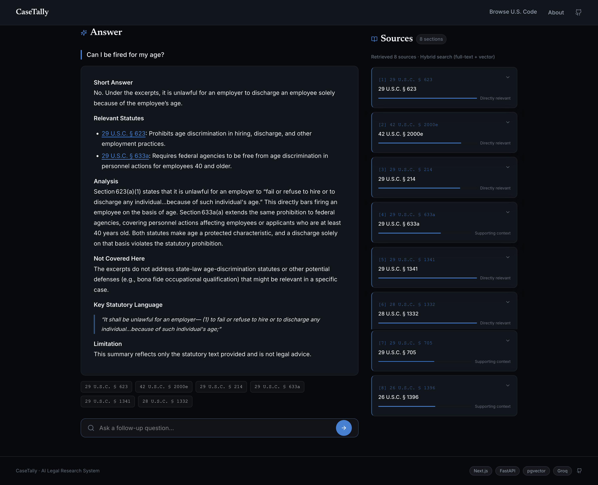

# CaseTally

A legal research platform for searching the U.S. Code using hybrid search and LLM-generated answers with citations.

**Highlights**

- Plain hybrid retrieval: MRR 0.85, P@3 0.78 on the core benchmark
- Issue decomposition: 83% of expected statutes reach the model (plain search 77%), and 88% on everyday questions (plain 63%)
- Search latency: p50 45ms (from 325ms), p95 105ms
- Worker queue: 3,000/3,000 rows with zero loss or duplication across graceful shutdown and SIGKILL
- KEDA autoscaling: workers 0 to 3 on queue depth, back to 0 when idle
- Zero-downtime rollouts: 240 requests, 0 failures
- Citation guard: any cited section the model wasn't given is flagged in the UI

Each number is measured, and how it was measured is explained further down.

---

## What It Does

Ask a legal question in plain English. CaseTally splits the question into the separate legal
issues it raises, phrases each one in statutory language, searches 83,706 U.S. Code chunks for
each issue in parallel, fuses the rankings, and streams a cited answer back as it is generated.

Splitting the question is the part that matters. A single rewrite collapses the question into one
bag of terms, so one ranking has to cover every issue at once, and the terms that surface one
issue push the others down. Searching per issue and fusing afterwards lets each issue compete on
its own terms.

"Can I be fired for my age?" becomes three sub-queries, one per issue:

| Issue | Sub-query |
| --- | --- |
| age discrimination | `age discrimination employment protection` |
| termination | `termination unlawful discrimination` |
| statutory violation | `unlawful age discrimination statute` |

Each runs as its own hybrid search. The fused result puts 29 U.S.C. § 623 in front of the model,
and the answer quotes the statute's own words: it is unlawful to "fail or refuse to hire or to
discharge any individual... because of such individual's age".

Not every question works. The ones that still fail, and why, are in Evaluation under Known
failures.

---

## Screenshots


Answering *"Can I be fired for my age?"*. The streamed answer cites 29 U.S.C. § 623 and § 633a, explains that § 623(a)(1) makes it unlawful to "fail or refuse to hire or to discharge any individual... because of such individual's age", and quotes that language verbatim under Key Statutory Language. The eight sections the model was actually given are ranked alongside it, and the answer names what the excerpts do not cover, here state age-discrimination statutes and defences such as a bona fide occupational qualification.



---

## System Architecture

Two retrieval paths, and they are not the same. The chat page streams answers and gets its
sources from that stream; the Browse U.S. Code page runs a plain search.

```text
Browser
  │
  ├─ GET  /                  Next.js frontend (port 3000)
  ├─ POST /v1/chat/stream    chat page, answers
  └─ POST /v1/search         Browse U.S. Code page, plain search


ANSWER PATH   POST /v1/chat/stream
  │
  ▼
Issue decomposition, 3 or 4 sub-queries                       Groq API
  │
  ▼
One hybrid search per sub-query, run concurrently             PostgreSQL
  ├─ full-text   ts_rank_cd
  └─ vector      pgvector, HNSW cosine sim
  │
  ▼
Reciprocal rank fusion, within then across sub-queries        k=20
  │
  ▼
Context selection
  8 chunks, round-robin by issue, max 2 per citation,
  3 slots reserved for the fused ranking
  │
  ▼
LLM answer                                                    Groq API
  │
  ▼
Citation guard
  sections cited but never supplied are flagged as unverified
  │
  ▼
SSE to the browser: sources first, then tokens
  The sources panel is filled from this stream. The chat page
  never calls /v1/search, so the panel cannot disagree with
  what the model was given


PLAIN SEARCH   POST /v1/search
  │
  ▼
One query, exactly as asked: no decomposition, no rewrite     PostgreSQL
  ├─ full-text   ts_rank_cd
  └─ vector      pgvector, HNSW cosine sim
  │
  ▼
Reciprocal rank fusion, ranked rows returned                  k=20
  Used by the Browse U.S. Code page and by the eval harness


EMBEDDING WORKER   offline
  Queue is a NULL column in Postgres, claimed with FOR UPDATE SKIP LOCKED
  KEDA scales 0 to 3 replicas on queue depth, worker state in Redis
```

---

## Request Flow

```text
1. User asks: "can I be fired for my age"

2. Issue decomposition (Groq, non-streaming, seed=1)
   ├─ 3 or 4 sub-queries in statutory language, one per legal issue:
   │    age discrimination    -> "age discrimination employment protection"
   │    termination           -> "termination unlawful discrimination"
   │    statutory violation   -> "unlawful age discrimination statute"
   └─ If Groq is unavailable, returns nothing, or raises, the request
      falls back to a single rewritten query instead of failing

3. Hybrid search per sub-query (PostgreSQL), run concurrently
   ├─ Lexical: ts_rank_cd(search_vector, OR-joined to_tsquery)    top 50
   ├─ Vector:  embedding <=> query_vector  [HNSW, ef_search=200]  top 50
   └─ Fuse within the sub-query: RRF k=20, equal weights -> top 20

4. Fuse across sub-queries: RRF k=20 -> top 30 candidates
   └─ Every sub-query carries equal weight, since nothing says which
      issue the user cared about most. A chunk that several sub-queries
      agree on accumulates contributions and rises

5. Context selection -> the 8 chunks the model actually sees
   ├─ Round-robin across issues, so one issue cannot take every slot
   ├─ The top 3 slots are reserved for the fused ranking
   ├─ At most 2 chunks per citation
   ├─ A capped citation spends its slots on its best-matching chunks,
   │  scored by how many distinct question terms each one covers,
   │  weighted by how rare the term is among the candidates, not by rank
   └─ Each chunk is cut to 1500 characters. The first 1500 are the
      default, and a later window replaces them only if it covers at
      least 2 more distinct question terms, since statutes put the
      operative rule near the top of a section

6. LLM answer (Groq, streaming)
   ├─ openai/gpt-oss-20b, max_tokens=2048
   └─ Tokens streamed via SSE -> react-markdown renders live

7. Citation guard
   └─ Every "N U.S.C. § M" in the finished answer is checked against
      what was actually supplied. Anything else is sent as an
      "unverified" list and flagged in the UI

8. Sources panel: the same retrieval, emitted as an SSE "sources"
   event before the first token. One search serves both
```

Failures are explicit, never a blank answer or a spinner that never stops. Retrieval failing,
every sub-query failing, no results at all, and a stream that produces zero tokens each emit
their own SSE error event with a message the UI can show.

---

## Services

### `casetally-frontend`: Next.js (port 3000)

- Search page with multi-turn chat, SSE token streaming, source cards
- Browse U.S. Code page: 3-panel layout with `LegalTextRenderer` parsing `(a)(b)(1)(A)` statute structure
- Homepage with sample queries, stats bar, how-it-works section
- Flags unverified citations inline, so a section the model cited but was never given is visible rather than silent
- Built as a Docker image and run on Kubernetes, 2 replicas behind Traefik. Next.js `output: 'standalone'` emits a self-contained server bundle, so the runtime stage installs nothing and ships only what the build actually imported. `npm run dev` is still the quick single-service loop, but it is no longer how the app runs

### `casetally-backend`: FastAPI (port 3001)

- `POST /v1/chat/stream`: issue decomposition → parallel hybrid search → fusion → context selection → SSE-streamed LLM answer
- `POST /v1/search`: hybrid search only, no rewrite and no decomposition, p50 45ms retrieval across 83k+ chunks (see Evaluation for how measured)
- `POST /v1/rewrite`: exposes single-query rewriting as a standalone endpoint. The answer path uses it only as a fallback when decomposition is unavailable
- `GET /health/live`: returns ok if the process is up, and deliberately checks nothing else. A liveness probe that pinged Postgres would make a brief database outage restart every API pod, turning one failure into two
- `GET /health/ready`: runs a real `SELECT 1` and returns 503 if it fails, so a pod that cannot reach Postgres is pulled out of the Service instead of serving errors
- Citation guard: after the answer finishes, every `N U.S.C. § M` it cites is matched against the sections actually supplied. Anything unmatched is emitted as an `unverified` list and flagged in the UI, so a hallucinated or mis-transcribed citation is visible instead of passing as sourced
- Explicit SSE error events for retrieval failing, every sub-query failing, no results, and a stream returning zero tokens. Each one carries a message the UI renders, so none of these can show up as a blank answer or a spinner that never resolves
- Errors are masked for users: every failure returns a friendly message and a short reference id, and the full exception with its traceback stays in the server logs under that same id. No exception text, SQL, hostname or path reaches the browser, including from `/health/ready`, which is exposed through the ingress. A global handler covers unexpected 500s so nothing escapes unmasked
- Vector search degrades to full-text-only when the embedding model is unavailable (the package failed to import, or `SEARCH_EMBEDDING_ENABLED=false`), and the response reports `embedding_used` so the path taken is visible. This covers the model being *unavailable*, not *failing*: a load or encode error mid-request propagates as a 500

### `casetally-db`: PostgreSQL 16 + pgvector 0.8.6

- `legal_chunks`: table: 83,706 rows, each with `text_content`, `search_vector` (tsvector), `embedding` (vector(384))
- HNSW index on `embedding` column for sub-linear ANN lookup
- GIN index on `search_vector` for full-text search
- Triggers auto-update `search_vector` on insert/update
- `legal_artifacts`: rows carry the same `version_hash` as the chunk they belong to, so a search result and the source PDF it links to cannot drift apart when a statute is re-ingested
- Kubernetes runs `pgvector/pgvector:pg16`, which is PostgreSQL 16.15 with pgvector 0.8.6, and is where the corpus actually lives. Docker Compose still uses `ankane/pgvector:latest`, which is PostgreSQL 15.4, so the two environments are a major version apart

### `casetally-workers`: Embedding Worker

- Polls `legal_chunks WHERE embedding IS NULL AND is_current AND retry_count < MAX_EMBED_RETRIES` (default 3)
- Claims each batch with `FOR UPDATE SKIP LOCKED`, so concurrent workers take disjoint rows instead of all selecting the same lowest ids; locks release on commit, so a crashed worker's rows requeue immediately
- On batch failure, re-encodes the batch row by row and increments `retry_count` only on the chunk that raised, so one bad row cannot strand the other 99. The counter is written from a separate session because the batch transaction has already rolled back
- Batch encodes via `sentence-transformers/all-MiniLM-L6-v2` on CPU
- Writes 384-dim vectors back to DB in a single bulk executemany call
- State tracked in Redis (IDLE → PROCESSING → IDLE) with heartbeat. State and metrics keys expire after 300s and the heartbeat after 30s. The gap is deliberate, so an observer can tell a dead worker from an idle one
- On Kubernetes, KEDA scales the workers from 0 to 3 replicas on queue depth, so an empty queue costs nothing (see Kubernetes for the ScaledObject and the measured run)

### `casetally-ingestion`: Ingestion CLI

- Custom section-by-section HTML parser across govinfo.gov files for all 53 existing U.S. Code titles (Title 53 is reserved and has no content), extracting section structure and cross-referencing PDF page offsets from embedded markup comments
- Chunks text by section, writes to `legal_chunks`
- Idempotent: SHA256 version hash per section: re-runs skip unchanged content, update changed content, and reset embeddings only when text changes
- Stale-chunk deactivation runs once per citation at the end of a run, using the union of every `clause_id` seen, so a citation appearing as multiple section headings cannot retire the chunks written by its own earlier occurrence
- Verified corpus-wide: a full re-run across all 53 titles skips all 50,915 parsed section headings with 0 inserts, 0 updates, and 0 deactivations, leaving the database unchanged. Those headings resolve to 47,207 unique citations, 3,708 fewer, because some sections appear under more than one heading in the source HTML, which in turn chunk into 83,706 rows

### `casetally-infrastructure`: deployment configs

- `k8s/`: the Kubernetes manifests, the vendored KEDA release, and `up.sh`, which brings the whole cluster up from nothing. This is the primary setup
- `docker-compose.local.yml`: full local stack (postgres, redis, backend, worker, frontend, adminer)
- `casetally-infra-prod/`: a production-style Compose setup, with Traefik reverse proxy config and a Let's Encrypt volume layout. It is a reference for how the stack would be fronted on a real host; nothing is deployed from it

---

## Stack

| Layer | Technology |
| --- | --- |
| Frontend | Next.js 16, React 19, TypeScript |
| Backend | Python 3.11, FastAPI, SQLAlchemy 2.0 |
| Database | PostgreSQL 16 + pgvector 0.8.6 (PostgreSQL 15 under Docker Compose) |
| Search | Hybrid PostgreSQL full-text (`ts_rank_cd`) + vector, HNSW indexing |
| Embeddings | sentence-transformers (all-MiniLM-L6-v2, 384-dim) |
| LLM | Groq API (openai/gpt-oss-20b) |
| Cache | Redis (worker state) |
| Orchestration | Kubernetes on kind (node v1.36.4) |
| Autoscaling | KEDA 2.21.0, Postgres scaler on queue depth |
| Ingress | Traefik v3.3 (v2.10 under Docker Compose) |
| Data source | govinfo.gov HTML, 53 U.S. Code titles |

---

## Key Technical Decisions

**Why hybrid search?**
Legal text has precise terminology, `§ 1983`, `habeas corpus`, `mens rea`. PostgreSQL full-text search, ranked with `ts_rank_cd` cover density over OR-joined terms, catches exact statute numbers that semantic search misses. Vector search catches meaning when phrasing differs. Fusion beats either alone.

**Why query rewriting?**
User language and legal language do not match. "Can my boss fire me?" contains none of the words in the statutes that answer it. Measured over eight runs, rewriting slightly hurts the core group: Precision@3 0.78 to 0.70, Recall@5 0.83 to 0.82, MRR 0.85 to 0.81. It earns its place on the colloquial employment questions instead, where mean MRR goes from 0.38 to 0.81. It is kept as the fallback for when decomposition is unavailable, since the questions that need a fallback are the colloquial ones.

**Why decompose into issues instead of rewriting once?**
A rewrite is still one query, so one ranking has to serve every issue the question raises, and the terms that surface one issue bury the others. "Can I be fired for my age?" becomes three sub-queries, one aimed at age discrimination, one at unlawful termination and one at the statutory violation itself. Each is searched separately and the rankings are fused, which puts 29 U.S.C. § 623 and § 633a in front of the model. The answer path decomposes; `/v1/search` does not, and single rewriting survives only as the fallback when decomposition is unavailable.

The measured result is a deliberate trade, not a clean win. On the core 15, which are already phrased in statutory language, decomposition drops MRR from 0.85 to 0.72 and Precision@3 from 0.78 to 0.58, because there is nothing to translate and each sub-query brings its own tangent. On the colloquial employment questions it roughly doubles MRR, 0.38 to about 0.81, and raises the share of expected statutes reaching the model from 0.63 to 0.88. Real users write colloquially, so that is the trade worth taking. Rewriting reaches a similar MRR on that group, so the case for decomposition rests on the context coverage rather than on beating the fallback at ranking.

The obvious next step, not built: route by question style, sending statute-phrased queries straight to plain search and decomposing only the everyday ones. That would keep both numbers instead of trading one for the other, and the classifier can be cheap, since the two kinds of question look very different.

**Why RRF instead of averaging scores?**
`ts_rank_cd` and cosine distance are not on the same scale and have no fixed relationship, so averaging them means inventing a conversion and then tuning it per query. Reciprocal rank fusion only reads positions, so there is nothing to calibrate, and one branch returning unusually large scores cannot swamp the other. It also composes: the same k=20 fuses lexical against vector within a sub-query, then fuses the sub-query lists against each other, and a chunk several sub-queries agree on accumulates contributions and rises.

**Why HNSW over ivfflat?**
HNSW (Hierarchical Navigable Small World) provides better recall, handles inserts without retraining, and is what production vector databases (Weaviate, Qdrant) use internally. Replaced ivfflat after initial ingestion.

**Why is Postgres itself the work queue?**
The embedding queue is just `WHERE embedding IS NULL`, claimed with `FOR UPDATE SKIP LOCKED`. Concurrent workers take disjoint rows instead of contending over the lowest ids, and the claim lives in the same transaction as the write, so a crashed worker's rows requeue the moment its locks release. A separate broker would need its own deployment and would put the queue and the data in different systems, which is exactly where lost and duplicated work comes from. The rows are the queue, so they cannot disagree.

**Why does KEDA scale on queue depth rather than CPU?**
CPU is a lagging signal for this workload. The worker is only busy once it has already claimed rows, so scaling on CPU means waiting for a backlog to cause load before adding capacity, and it cannot reach zero, because an idle worker polling an empty queue still looks alive. Queue depth is the thing being worked off, so KEDA reads it directly from Postgres and scales 0 to 3. An empty queue runs no pods at all.

**Why SSE over WebSocket?**
Token streaming is one-directional (server → client). SSE is HTTP-native, auto-reconnects, and works through proxies, no overhead of a persistent bidirectional socket.

**Why PostgreSQL for vectors instead of a dedicated vector DB?**
Single database keeps full-text and vector search in one query with no cross-service joins. pgvector on PostgreSQL covers both at zero extra cost or infrastructure complexity.

---

## Evaluation

A retrieval evaluation harness lives in `scripts/eval_retrieval.py`. It runs 19 benchmark legal queries in two groups, against the live search endpoint for the single-query modes and in-process for the decomposition mode, and measures:

- **Precision@3**: fraction of top-3 results from the correct U.S. Code title
- **Recall@5**: fraction of expected titles found in top-5 results
- **MRR**: mean reciprocal rank of the first relevant result

The **core** group is the original 15 queries. The **employment** group is 4 colloquially-phrased
queries added as a regression test, reported separately so adding them cannot move the core
numbers.

```bash
python scripts/eval_retrieval.py
python scripts/eval_retrieval.py --backend http://localhost:3001 --top-k 5 --rewrite

# The decomposition path. Runs the answer path's retrieval in-process, so it has
# to run where the app is importable, and it needs no backend URL. It calls
# decompose_query, search_multi and _select_context with the arguments chat.py
# uses, and generates no answers.
kubectl cp scripts/eval_retrieval.py casetally/<api-pod>:/tmp/eval_retrieval.py
kubectl exec -n casetally <api-pod> -- sh -c \
  'cd /app && PYTHONPATH=/app python3 /tmp/eval_retrieval.py --mode decompose --runs 3'
```

`--sleep` paces the Groq calls, because the account limit is per-minute tokens. It defaults to
7.5s for decompose and 0 for rewrite, so the two commands above behave as they always did.

### Results (core 15 queries)

Three retrieval paths. Plain hybrid search is what `/v1/search` serves, so it is the retrieval
floor everything else sits on. Single rewriting is the fallback the answer path takes when
decomposition is unavailable. Decomposition is the live path, what a chat answer actually uses.

Means are pooled over every run of each mode, with the range across runs in brackets.

| Metric | Plain hybrid | Single rewrite | Decomposition |
| --- | --- | --- | --- |
| Mean Precision@3 | 0.78 | 0.70 (0.67 to 0.73) | 0.58 (0.56 to 0.64) |
| Mean Recall@5 | 0.83 | 0.82 (0.79 to 0.83) | 0.84 (0.83 to 0.86) |
| Mean MRR | 0.85 | 0.81 (0.77 to 0.85) | 0.72 (0.71 to 0.76) |
| Expected titles in the 8 chunks sent to the model | 19/23 = 0.83 | not measured | 113/138 = 0.82 |
| Runs | 1, deterministic | 8 | 6 |
| p50 latency | 26ms | 72ms (incl. rewrite call) | 256ms (3 searches, in-process) |
| p95 latency | 105ms | 160ms | 471ms |

The titles row is the one worth reading first. The first three score a ranking, but the model
never sees a ranking: it sees the 8 chunks context selection hands it, and it can only cite a
statute it was given. Counting how many expected titles reach those 8 chunks is the closest thing
here to an end-to-end retrieval number, and it is the only row where the three paths are doing
the same job. Across all 19 queries it is 24/31 = 0.77 for plain and 155/186 = 0.83 for
decomposition.

On the core group plain and decomposition are about level on that row, 0.83 against 0.82, and the
per-session values for decomposition were 0.80 and 0.84 either side of it. No claim is made that
decomposition retrieves better context here. The difference shows up on the other group.

The latency rows come from one session rather than being pooled, and are not comparable across
columns anyway, for the reason below.

Decomposition's latency is higher for a real reason and is not comparable to the other two
columns: it runs three searches instead of one, in-process rather than over a port-forward, and
the figure excludes the decompose LLM call that precedes them.

**How these were measured.** `scripts/eval_retrieval.py` against the Kubernetes deployment,
through a `kubectl port-forward` to the API Service, with the embedding model warm and all 53
titles ingested. Latency is the server-reported `took_ms`, so it covers retrieval and fusion but
not the port-forward hop.

The headline latency figure quoted elsewhere, **p50 45ms and p95 105ms**, comes from a wider set
of 64 varied queries rather than this 19-query benchmark, measured the same way and averaged over
three warm runs. Both are reported because the benchmark exists to track quality and the wider set
is a fairer latency sample: p50 325ms to 45ms is the before and after of the profiling work.

**Plain hybrid search is deterministic and reproduces exactly. The two LLM paths do not.** An
earlier version of this table reported the rewrite column as 0.73 / 0.79 / 0.88 from a single
run. Re-measuring over eight runs gives 0.70 / 0.82 / 0.81, with core MRR ranging 0.77 to 0.85.
The rewrite prompt and `rewrite_query` are byte-identical to the commit that produced the old
figures, so nothing regressed: the 0.88 was simply one favourable draw, and it sits above every
value seen in eight later runs. The lesson is that a single run of an LLM-dependent path is not a
measurement, which is why both LLM modes here are pooled over every run with their ranges shown.

**Latency was once much worse, and the causes were specific.** An intermediate version of this
table reported p50 97ms and p95 574ms, against p50 18ms for the original AND-semantics lexical
branch. Moving that branch to OR semantics grew the candidate pool into the tens of thousands,
because `LIMIT` bounds what is returned rather than what is scanned, and that bought Precision@3
0.64 to 0.78 and MRR 0.69 to 0.85. Profiling then found most of the remaining cost was not
inherent: an `ORDER BY distance, id` tiebreaker on the vector branch made the ordering
unsatisfiable by the HNSW index, so every vector search sequentially scanned all 83,706 rows;
`hnsw.ef_search` was below the number of rows requested, so the branch silently returned 40 of 50;
`shared_buffers` was at its 128MB default against a 664MB database, leaving the table cache hit
ratio at 72.9%; and torch sized its thread pool from the host CPU count rather than the container
limit. With those corrected, retrieval is back to sub-50ms p50 while keeping the recall that OR
semantics bought.

**Query rewriting no longer helps on the core group, and is kept as the fallback anyway.** Over
eight runs it costs Precision@3 0.78 to 0.70, leaves Recall@5 about level at 0.83 to 0.82, and
takes MRR from 0.85 down to 0.81. That is a small loss, not the gain this section used to claim.
What justifies keeping it is the other group: on the colloquially-phrased employment questions it
moves mean MRR from 0.38 to 0.81, which is the difference between useless and useful. So when
decomposition is unavailable, a rewritten query is still a better thing to fall back to than the
raw question, because the questions most likely to need the fallback are the colloquial ones.

### Results (employment group, 4 queries)

Added because the project's own headline example, "can my boss fire me", returned pension and tax
statutes. These scores should be read with care: relevance is scored by U.S. Code title number, and
Titles 42 and 29 are large, so a pension section in Title 29 counts as relevant for an unfair
dismissal question. The group is a regression tripwire, not a quality measure. Whether the
protection statute itself reaches the model has to be checked by reading the answer.

| Metric | Plain hybrid | Single rewrite | Decomposition |
| --- | --- | --- | --- |
| Mean Precision@3 | 0.25 | 0.66 (0.50 to 0.83) | 0.67 (0.67 to 0.67) |
| Mean Recall@5 | 0.38 | 0.78 (0.62 to 0.88) | 0.90 (0.88 to 1.00) |
| Mean MRR | 0.38 | 0.81 (0.62 to 1.00) | 0.81 (0.75 to 0.88) |
| Expected titles in the 8 chunks sent to the model | 5/8 = 0.63 | not measured | 42/48 = 0.88 |
| Runs | 1, deterministic | 8 | 6 |

**Read the two LLM columns as ranges, not as a ranking.** With 4 queries, a single query moves a
mean by 0.25, and the ranges show it: rewriting's MRR alone ran from 0.62 to 1.00 across eight
runs. Both LLM modes come out at mean MRR 0.81 here, and their ranges overlap almost completely,
so this group cannot say which of the two is better on that metric. Across the two measurement
sessions the ordering actually reversed. What it does say, unambiguously, is that both beat plain
search: every one of the fourteen LLM runs scored above plain's 0.38, the lowest being 0.62.

**The trade-off, in plain words.** Decomposition costs ranking quality on questions already
written in statutory language, where core MRR falls from 0.85 to 0.72, and roughly doubles it on
everyday questions, where MRR rises from 0.38 to about 0.81 and context coverage from 0.63 to
0.88. That is the expected shape: a core query like "patent eligibility requirements invention"
is already phrased the way the statute is, so there is nothing to translate and splitting it only
adds a tangent for each sub-query to chase. It was chosen anyway, because CaseTally's users ask in
everyday language, and on that kind of question plain search puts nothing useful in front of the
model at all. For "can my boss fire me" the plain path's 8 chunks contained no relevant title;
decomposition's contained both in all six runs.

Context coverage is the sturdiest number in this group: 42/48 = 0.88 for decomposition against
5/8 = 0.63 for plain, and it came out at exactly 21/24 in both sessions independently.

**Caveats, briefly.** The employment group is only 4 queries, so its means move a lot per query
and the ranges above are wide. Decomposition varies between runs: within a session, 12 of 19
queries in one and 14 of 19 in the other produced identical sub-queries in all three runs, and
the rest did not. And Precision@3 is partly capped by construction for
a multi-issue ranking, because it always divides by 3 while a fused list deliberately interleaves
issues, so when only one of three issues maps to the expected title the metric cannot exceed about
0.33 however good the retrieval is. MRR and context coverage do not have that problem, which is
why they carry more weight here.

**One finding worth keeping.** Sub-queries that echo a statute's popular name hurt. On "clean
water act pollution discharge permit", two of three runs prefixed every sub-query with "clean
water act", which lexically matched cross-references to the Act in `43 U.S.C. § 364f` and
`26 U.S.C. § 9502` and pushed Title 33 down to P@3 0.00. The third run dropped the name and used
"pollution discharge permit requirements" instead, and scored P@3 1.00. The popular name is the
one phrase guaranteed to appear in every other title that references the statute.

**Effect of corpus coverage.** An earlier run against 22 of 53 titles (32,969 chunks) scored
P@3 0.31, R@5 0.34, MRR 0.39. Seven benchmark queries scored 0.00 purely because their titles
were absent. Ingesting the remaining 31 titles more than doubled every metric, and latency
*improved* despite 2.5x the data, since HNSW lookup is sub-linear in corpus size.

### Known failures

**"Wire fraud criminal penalties" scores 0.00 in both modes**, even though `18 U.S.C. § 1343` is
present with correct text. Two factors remain: 512-word chunking scatters the statute's terms
across chunks, and "wire fraud" is a colloquial label absent from statutory text that reads
"scheme or artifice to defraud" transmitted "by means of wire". The governing chunk contains
neither "criminal" nor any form of "penalty".

The original diagnosis also blamed `plainto_tsquery` requiring every term in one chunk. That is
fixed: the lexical branch now ORs terms, so the branch no longer excludes the chunk before ranking.
The query still scores 0.00, which means the vocabulary gap alone is sufficient to fail it.

**"Can my boss fire me?" still refuses to answer**, and it stays in the eval set as a failing
test. What changed is where it fails. It decomposes into "termination of employment at will",
"employment discrimination unlawful termination" and "retaliatory termination unlawful", and the
two statutes that answer it, 29 U.S.C. § 623 and 42 U.S.C. § 2000e, now do reach the model among
the eight selected chunks. Pension-plan termination statutes
(29 U.S.C. § 1341 and § 1341a) also land in that context, because "termination" in this corpus
overwhelmingly means plan termination, and the model reasons about those and about tax law instead
of the two discrimination statutes sitting lower in the same list. The failure moved from retrieval
to generation rather than going away.

Full per-query output for all three modes is committed to `scripts/eval_results.txt`.

---

## Kubernetes (primary local setup)

The whole stack runs on a local [kind](https://kind.sigs.k8s.io/) cluster. This is
now the primary way to run CaseTally locally. Docker Compose still works and is
documented below, but Kubernetes is where the components, probes, scaling and
failure behaviour actually live.

### Cluster prerequisites

- Docker Desktop, with at least 6 GiB allocated to its VM
- [kind](https://kind.sigs.k8s.io/) and `kubectl`
- A Groq API key (free at console.groq.com)

Create `casetally-infrastructure/k8s/.env.k8s` with two unquoted lines before the
first run. It is gitignored and never committed:

```bash
POSTGRES_PASSWORD=choose-one
GROQ_API_KEY=your-key
```

### Bring it up

```bash
cd casetally-infrastructure/k8s
./up.sh          # cluster, images, manifests, corpus restore, smoke tests
./down.sh        # delete the cluster
```

Then open <http://localhost>. A from-scratch bring-up takes about three minutes
when the images already exist, and `up.sh` prints a per-phase timing breakdown.

`up.sh` is idempotent and reuses images it has already built. Pass `--rebuild`
after changing application code, and `--skip-data` to deploy without loading the
corpus. `down.sh --keep-data` drops the workloads but keeps the database.

### What runs where

| Component | Kind | Replicas | Notes |
| --- | --- | --- | --- |
| Postgres 16 + pgvector 0.8.6 | StatefulSet | 1 | 8Gi PVC, schema from `init.sql` via ConfigMap |
| Redis 7 | Deployment | 1 | No persistence, worker state only |
| API (FastAPI) | Deployment | 2 | Model warm before the port opens |
| Embedding worker | Deployment | **0-3, autoscaled** | No Service, `SKIP LOCKED` queue; KEDA scales it on queue depth |
| Frontend (Next.js) | Deployment | 2 | Standalone output, relative API URLs |
| Traefik | Deployment | 1 | hostPort 80/443, path-based routing |
| Ingestion | Job | 1 | One-shot, advisory-locked; pause the ScaledObject first |
| KEDA 2.21.0 | 3 Deployments | 1 each | In the `keda` namespace; memory limits trimmed to 192Mi each from upstream's 1000Mi |

Routing is single-origin, so there is no CORS: `/` serves the frontend, `/v1` and
`/health` go to the API.

Secrets are `POSTGRES_PASSWORD` and `GROQ_API_KEY` only, read from a gitignored
`casetally-infrastructure/k8s/.env.k8s`. `DATABASE_URL` is assembled in the pod
spec so the password has one source of truth. See
[`secret.example.yaml`](casetally-infrastructure/k8s/secret.example.yaml).

### Worker demo

The corpus is fully embedded, so the worker queue is normally empty and the
worker tier normally runs **zero** replicas. `demo-worker.sh` manufactures a
backlog, lets KEDA scale the tier up on its own, and proves across a graceful
shutdown, a real SIGKILL and KEDA's own scale-downs that no row is lost or
embedded twice:

```bash
cd casetally-infrastructure/k8s
./demo-worker.sh backlog 3000 && ./demo-worker.sh watch
./demo-worker.sh graceful     # or: ./demo-worker.sh crash
./demo-worker.sh verify
```

Nothing in the demo scales anything by hand. `watch` shows the replica count
climbing and falling as the queue drains. Measured on a 3,000 row backlog:

| | Measured across 3 runs |
| --- | --- |
| first worker Ready, from an empty tier | 16-21s |
| first row committed | 24-31s |
| 3 replicas Ready | 17-21s |
| queue drained | 152-182s |
| back to 0 replicas after the queue emptied | 61s |

The tier also steps **down** while still working, 3 to 2 to 1 as the queue
shrinks past each 1,000-row threshold, so the demo exercises a scale-down landing
on a busy worker without anyone arranging it. Rows survive that for the same
reason they survive SIGKILL: the queue is `embedding IS NULL` in Postgres and
claims are held with `FOR UPDATE SKIP LOCKED` until commit.

`verify` accounts for every row by pod, including pods that no longer exist:

```text
casetally-worker-9b79c8779-2p66v   committed 300
casetally-worker-9b79c8779-h2ml9   committed 900
casetally-worker-9b79c8779-7h9xt   committed 1500
casetally-worker-9b79c8779-299b4   committed 300
sum of per-worker committed = 3000   (N = 3000)
```

That tally is a Redis hash the worker increments after each commit returns, with
no TTL and no deletion on shutdown, because autoscaling made the previous
approach unworkable: it read each worker's log, and pods KEDA scaled away took
their logs with them. The log-based cross-check in the same run reports 1800 of
3000, which is the gap the hash exists to close. Redis runs without persistence,
so a Redis restart mid-run resets the tally; the row-level checks against the
backup table remain the authority.

Full runbook, design rationale and replay commands:
[casetally-infrastructure/k8s/README.md](casetally-infrastructure/k8s/README.md).

---

## Local Setup (Docker Compose)

Still supported, and the Kubernetes corpus was migrated out of it. Kubernetes is
the primary local setup; use this for a quick single-service loop.

### Prerequisites

- Docker and Docker Compose
- Node.js 18+
- Groq API key (free at console.groq.com)

### Run

```bash
cp .env.local.example .env.local
# Add your GROQ_API_KEY to .env.local

# Start backend, postgres, redis
docker compose -f docker-compose.local.yml --env-file .env.local up -d

# Start frontend
cd casetally-frontend && npm install && npm run dev
```

Frontend: http://localhost:3000
Backend: http://localhost:3001
API docs: http://localhost:3001/docs

### Ingest data (one-time)

```bash
docker compose -f docker-compose.local.yml run --rm ingestion python cli.py --source uscode
```

---

## License

MIT
