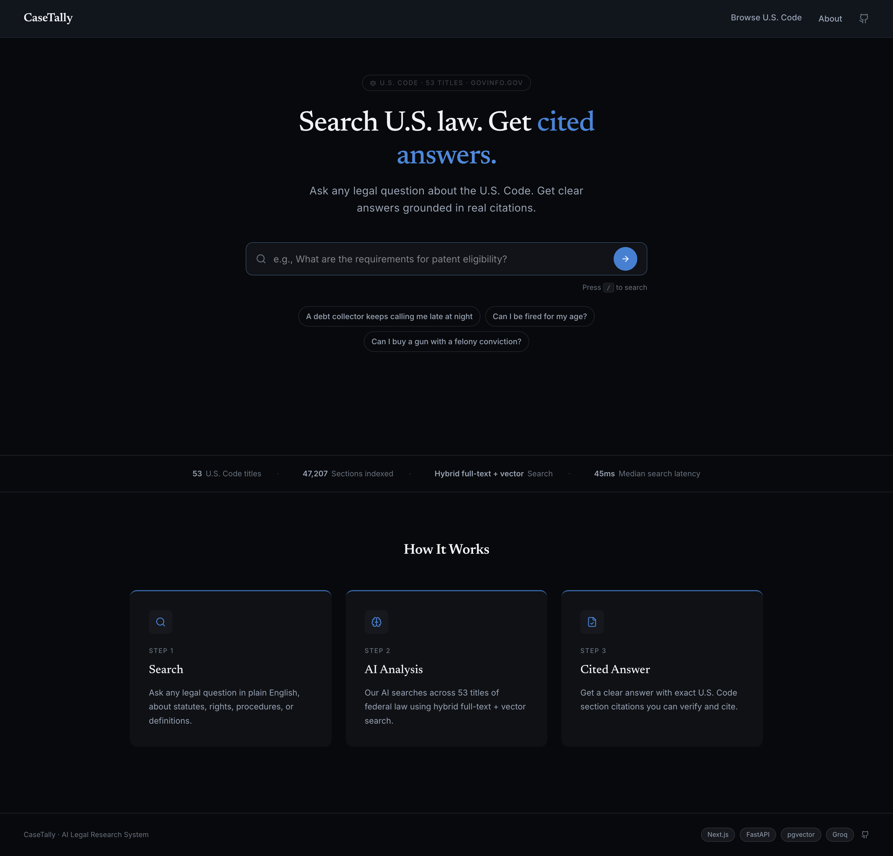

# CaseTally

A legal research platform for searching U.S. statutes, codes, and regulations using hybrid search and LLM-powered answers.

---

## What It Does

Ask any legal question in plain English. CaseTally rewrites your question into legal terminology, searches 83,706 U.S. Code chunks using hybrid full-text + vector search, and streams a cited answer back in real time.

> "Can I be fired for my age?" → rewrites to → "age discrimination employment unlawful termination prohibited"
> → retrieves 29 U.S.C. § 623 → streams an answer quoting the statute's own words

The example is deliberately one that works. "Can my boss fire me?" does not: it still returns
pension-plan termination statutes, because the statutes that answer it say "discharge" while the
question and its rewrite say "termination", which in this corpus overwhelmingly means plan
termination. It is in the eval set as a failing regression test.

---

## Screenshots



Answering *"copyright infringement damages"*, the streamed answer cites 17 U.S.C. § 504 and quotes the statutory text verbatim, with the ten retrieved sections ranked alongside it.


---

## System Architecture

```text
Browser
  │
  ├─ GET  /                    Next.js frontend (port 3000)
  ├─ POST /v1/chat/stream  ──► FastAPI backend (port 3001)
  └─ POST /v1/search       ──► FastAPI backend (port 3001)
                                    │
                    ┌───────────────┼───────────────┐
                    ▼               ▼               ▼
              Query Rewrite    Hybrid Search    Groq API
              (Groq API)       (PostgreSQL)     (LLM stream)
                                    │
                           ┌────────┴────────┐
                           ▼                 ▼
                      full-text         pgvector
                     ts_rank_cd      HNSW cosine sim
                           └────────┬────────┘
                                    ▼
                          Reciprocal rank fusion
                               (k=20)
                                    ▲
                             EmbeddingWorker
               (offline, NULL-column queue, Redis-tracked)
```

---

## Request Flow

```text
1. User types: "what happens if i dont pay taxes"

2. Query Rewriting (Groq, non-streaming)
   └─ Rewrites to: "tax debt collection unpaid tax penalties tax lien 26 usc 6851"

3. Hybrid Search (PostgreSQL)
   ├─ Lexical: ts_rank_cd(search_vector, OR-joined to_tsquery)  top 50
   ├─ Vector: embedding <=> query_vector  [HNSW index]          top 50
   └─ Fuse:   reciprocal rank fusion, k=20 → top 10

4. LLM Answer (Groq, streaming)
   ├─ Top 3 of those 10 chunks sent as context
   ├─ openai/gpt-oss-20b generates cited answer
   └─ Tokens streamed via SSE → react-markdown renders live

5. Sources panel: the same retrieval, emitted as an SSE "sources"
   event before the first token. One search serves both
```

---

## Services

### `casetally-frontend`: Next.js (port 3000)

- Search page with multi-turn chat, SSE token streaming, source cards
- Browse U.S. Code page: 3-panel layout with `LegalTextRenderer` parsing `(a)(b)(1)(A)` statute structure
- Homepage with sample queries, stats bar, how-it-works section
- Runs locally via `npm run dev` (not in Docker)

### `casetally-backend`: FastAPI (port 3001)

- `POST /v1/chat/stream`: query rewrite → hybrid search → SSE-streamed LLM answer
- `POST /v1/search`: hybrid search only, p50 45ms retrieval across 83k+ chunks (see Evaluation for how measured)
- `POST /v1/rewrite`: exposes query rewriting as a standalone endpoint
- `GET /health/ready`: liveness + real DB ping
- Query rewriting via `GroqService.rewrite_query()` before every retrieval
- Vector search degrades to full-text-only when the embedding model is unavailable (the package failed to import, or `SEARCH_EMBEDDING_ENABLED=false`), and the response reports `embedding_used` so the path taken is visible. This covers the model being *unavailable*, not *failing*: a load or encode error mid-request propagates as a 500

### `casetally-db`: PostgreSQL 15 + pgvector

- `legal_chunks`: table: 83,706 rows, each with `text_content`, `search_vector` (tsvector), `embedding` (vector(384))
- HNSW index on `embedding` column for sub-linear ANN lookup
- GIN index on `search_vector` for full-text search
- Triggers auto-update `search_vector` on insert/update
- `legal_artifacts`: rows carry the same `version_hash` as the chunk they belong to, so a search result and the source PDF it links to cannot drift apart when a statute is re-ingested

### `casetally-workers`: Embedding Worker

- Polls `legal_chunks WHERE embedding IS NULL AND is_current AND retry_count < MAX_EMBED_RETRIES` (default 3)
- Claims each batch with `FOR UPDATE SKIP LOCKED`, so concurrent workers take disjoint rows instead of all selecting the same lowest ids; locks release on commit, so a crashed worker's rows requeue immediately
- On batch failure, re-encodes the batch row by row and increments `retry_count` only on the chunk that raised, so one bad row cannot strand the other 99. The counter is written from a separate session because the batch transaction has already rolled back
- Batch encodes via `sentence-transformers/all-MiniLM-L6-v2` on CPU
- Writes 384-dim vectors back to DB in a single bulk executemany call
- State tracked in Redis (IDLE → PROCESSING → IDLE) with heartbeat. State and metrics keys expire after 300s and the heartbeat after 30s. The gap is deliberate, so an observer can tell a dead worker from an idle one

### `casetally-ingestion`: Ingestion CLI

- Custom section-by-section HTML parser across govinfo.gov files for all 53 existing U.S. Code titles (Title 53 is reserved and has no content), extracting section structure and cross-referencing PDF page offsets from embedded markup comments
- Chunks text by section, writes to `legal_chunks`
- Idempotent: SHA256 version hash per section: re-runs skip unchanged content, update changed content, and reset embeddings only when text changes
- Stale-chunk deactivation runs once per citation at the end of a run, using the union of every `clause_id` seen, so a citation appearing as multiple section headings cannot retire the chunks written by its own earlier occurrence
- Verified corpus-wide: a full re-run across all 53 titles skips all 50,915 parsed section headings with 0 inserts, 0 updates, and 0 deactivations, leaving the database unchanged. Those headings resolve to 47,207 unique citations, 3,708 fewer, because some sections appear under more than one heading in the source HTML, which in turn chunk into 83,706 rows

### `casetally-infrastructure`: Docker Compose configs

- `docker-compose.local.yml`: full local stack (postgres, redis, backend, worker, frontend, adminer)
- `casetally-infra-prod/`: Traefik reverse proxy config and Let's Encrypt volume layout for the production stack

---

## Stack

| Layer | Technology |
| --- | --- |
| Frontend | Next.js 16, React 19, TypeScript |
| Backend | Python 3.11, FastAPI, SQLAlchemy 2.0 |
| Database | PostgreSQL 15 + pgvector |
| Search | Hybrid PostgreSQL full-text (`ts_rank_cd`) + vector, HNSW indexing |
| Embeddings | sentence-transformers (all-MiniLM-L6-v2, 384-dim) |
| LLM | Groq API (openai/gpt-oss-20b) |
| Cache | Redis (worker state) |
| Data source | govinfo.gov HTML, 53 U.S. Code titles |

---

## Key Technical Decisions

**Why hybrid search?**
Legal text has precise terminology, `§ 1983`, `habeas corpus`, `mens rea`. PostgreSQL full-text search, ranked with `ts_rank_cd` cover density over OR-joined terms, catches exact statute numbers that semantic search misses. Vector search catches meaning when phrasing differs. Fusion beats either alone.

**Why query rewriting?**
User language and legal language don't match. "Can my boss fire me?" contains none of the words in the statutes that answer it, and rewrites to "termination rights employee termination unlawful dismissal at-will employment" before retrieval. Measured effect is a trade-off: MRR improves 10% while Precision@3 and Recall@5 drop slightly, so the right statute ranks higher but the top-5 window gets noisier.

**Why HNSW over ivfflat?**
HNSW (Hierarchical Navigable Small World) provides better recall, handles inserts without retraining, and is what production vector databases (Pinecone, Weaviate, Qdrant) use internally. Replaced ivfflat after initial ingestion.

**Why SSE over WebSocket?**
Token streaming is one-directional (server → client). SSE is HTTP-native, auto-reconnects, and works through proxies, no overhead of a persistent bidirectional socket.

**Why PostgreSQL for vectors instead of a dedicated vector DB?**
Single database keeps full-text and vector search in one query with no cross-service joins. pgvector on PostgreSQL covers both at zero extra cost or infrastructure complexity.

---

## Evaluation

A retrieval evaluation harness lives in `scripts/eval_retrieval.py`. It runs 19 benchmark legal queries in two groups against the live search endpoint and measures:

- **Precision@3**: fraction of top-3 results from the correct U.S. Code title
- **Recall@5**: fraction of expected titles found in top-5 results
- **MRR**: mean reciprocal rank of the first relevant result

The **core** group is the original 15 queries. The **employment** group is 4 colloquially-phrased
queries added as a regression test, reported separately so adding them cannot move the core
numbers.

```bash
python scripts/eval_retrieval.py
python scripts/eval_retrieval.py --backend http://localhost:3001 --top-k 5 --rewrite
```

### Results (core 15 queries)

Two modes: raw hybrid search, and hybrid search with LLM query rewriting (the actual user-facing flow).

| Metric | Without rewriting | With rewriting |
| --- | --- | --- |
| Mean Precision@3 | 0.78 | 0.73 |
| Mean Recall@5 | 0.83 | 0.79 |
| Mean MRR | 0.85 | 0.88 |
| p50 latency | 26ms | 72ms (incl. rewrite call) |
| p95 latency | 105ms | 160ms |

**How these were measured.** `scripts/eval_retrieval.py` against the Kubernetes deployment,
through a `kubectl port-forward` to the API Service, with the embedding model warm and all 53
titles ingested. Latency is the server-reported `took_ms`, so it covers retrieval and fusion but
not the port-forward hop.

The headline latency figure quoted elsewhere, **p50 45ms and p95 105ms**, comes from a wider set
of 64 varied queries rather than this 19-query benchmark, measured the same way and averaged over
three warm runs. Both are reported because the benchmark exists to track quality and the wider set
is a fairer latency sample: p50 325ms to 45ms is the before and after of the profiling work. Without rewriting the numbers are deterministic and reproduce exactly.
With rewriting they do not: the rewrite is a live LLM call, so the core means hold at roughly
0.73 / 0.79 / 0.88 across runs while individual queries move.

**Latency was once much worse, and the causes were specific.** An intermediate version of this
table reported p50 97ms and p95 574ms, against p50 18ms for the original AND-semantics lexical
branch. Moving that branch to OR semantics grew the candidate pool into the tens of thousands,
because `LIMIT` bounds what is returned rather than what is scanned, and that bought Precision@3
0.64 to 0.78 and MRR 0.69 to 0.85. Profiling then found most of the remaining cost was not
inherent: an `ORDER BY distance, id` tiebreaker on the vector branch made the ordering
unsatisfiable by the HNSW index, so every vector search sequentially scanned all 83,706 rows;
`hnsw.ef_search` was below the number of rows requested, so the branch silently returned 40 of 50;
`shared_buffers` was at its 128MB default against a 664MB database, leaving the table cache hit
ratio at 72.9%; and torch sized its thread pool from the host CPU count rather than the container
limit. With those corrected, retrieval is back to sub-50ms p50 while keeping the recall that OR
semantics bought.

**Query rewriting is still a trade-off, and it is worth taking.** On the core group it costs
Precision@3 0.78 to 0.73 and Recall@5 0.83 to 0.79 while raising MRR 0.85 to 0.88: the right
statute ranks higher, and the rest of the top-5 window gets noisier. For a tool that shows one
answer, MRR is the metric that matters. Rewriting is also what makes the colloquial employment
group work at all, where it is the difference between a mean MRR of 0.38 and 0.88.

### Results (employment group, 4 queries)

Added because the project's own headline example, "can my boss fire me", returned pension and tax
statutes. These scores should be read with care: relevance is scored by U.S. Code title number, and
Titles 42 and 29 are large, so a pension section in Title 29 counts as relevant for an unfair
dismissal question. The group is a regression tripwire, not a quality measure. Whether the
protection statute itself reaches the model has to be checked by reading the answer.

**Effect of corpus coverage.** An earlier run against 22 of 53 titles (32,969 chunks) scored
P@3 0.31, R@5 0.34, MRR 0.39. Seven benchmark queries scored 0.00 purely because their titles
were absent. Ingesting the remaining 31 titles more than doubled every metric, and latency
*improved* despite 2.5x the data, since HNSW lookup is sub-linear in corpus size.

**A query that still fails.** "Wire fraud criminal penalties" scores 0.00 in both modes even
though `18 U.S.C. § 1343` is present with correct text. Two factors remain: 512-word chunking
scatters the statute's terms across chunks, and "wire fraud" is a colloquial label absent from
statutory text that reads "scheme or artifice to defraud" transmitted "by means of wire". The
governing chunk contains neither "criminal" nor any form of "penalty".

The original diagnosis also blamed `plainto_tsquery` requiring every term in one chunk. That is
fixed: the lexical branch now ORs terms, so the branch no longer excludes the chunk before ranking.
The query still scores 0.00, which means the vocabulary gap alone is sufficient to fail it.

Full per-query output for both modes is committed to `scripts/eval_results.txt`.

---

## Kubernetes (primary local setup)

The whole stack runs on a local [kind](https://kind.sigs.k8s.io/) cluster. This is
now the primary way to run CaseTally locally. Docker Compose still works and is
documented below, but Kubernetes is where the components, probes, scaling and
failure behaviour actually live.

### Cluster prerequisites

- Docker Desktop, with at least 6 GiB allocated to its VM
- [kind](https://kind.sigs.k8s.io/) and `kubectl`
- A Groq API key (free at console.groq.com)

Create `casetally-infrastructure/k8s/.env.k8s` with two unquoted lines before the
first run. It is gitignored and never committed:

```bash
POSTGRES_PASSWORD=choose-one
GROQ_API_KEY=your-key
```

### Bring it up

```bash
cd casetally-infrastructure/k8s
./up.sh          # cluster, images, manifests, corpus restore, smoke tests
./down.sh        # delete the cluster
```

Then open <http://localhost>. A from-scratch bring-up takes about three minutes
when the images already exist, and `up.sh` prints a per-phase timing breakdown.

`up.sh` is idempotent and reuses images it has already built. Pass `--rebuild`
after changing application code, and `--skip-data` to deploy without loading the
corpus. `down.sh --keep-data` drops the workloads but keeps the database.

### What runs where

| Component | Kind | Replicas | Notes |
| --- | --- | --- | --- |
| Postgres 16 + pgvector 0.8.6 | StatefulSet | 1 | 8Gi PVC, schema from `init.sql` via ConfigMap |
| Redis 7 | Deployment | 1 | No persistence, worker state only |
| API (FastAPI) | Deployment | 2 | Model warm before the port opens |
| Embedding worker | Deployment | **0-3, autoscaled** | No Service, `SKIP LOCKED` queue; KEDA scales it on queue depth |
| Frontend (Next.js) | Deployment | 2 | Standalone output, relative API URLs |
| Traefik | Deployment | 1 | hostPort 80/443, path-based routing |
| Ingestion | Job | 1 | One-shot, advisory-locked; pause the ScaledObject first |
| KEDA 2.21.0 | 3 Deployments | 1 each | In the `keda` namespace; memory limits trimmed to 192Mi each from upstream's 1000Mi |

Routing is single-origin, so there is no CORS: `/` serves the frontend, `/v1` and
`/health` go to the API.

Secrets are `POSTGRES_PASSWORD` and `GROQ_API_KEY` only, read from a gitignored
`casetally-infrastructure/k8s/.env.k8s`. `DATABASE_URL` is assembled in the pod
spec so the password has one source of truth. See
[`secret.example.yaml`](casetally-infrastructure/k8s/secret.example.yaml).

### Worker demo

The corpus is fully embedded, so the worker queue is normally empty and the
worker tier normally runs **zero** replicas. `demo-worker.sh` manufactures a
backlog, lets KEDA scale the tier up on its own, and proves across a graceful
shutdown, a real SIGKILL and KEDA's own scale-downs that no row is lost or
embedded twice:

```bash
cd casetally-infrastructure/k8s
./demo-worker.sh backlog 3000 && ./demo-worker.sh watch
./demo-worker.sh graceful     # or: ./demo-worker.sh crash
./demo-worker.sh verify
```

Nothing in the demo scales anything by hand. `watch` shows the replica count
climbing and falling as the queue drains. Measured on a 3,000 row backlog:

| | Measured across 3 runs |
| --- | --- |
| first worker Ready, from an empty tier | 16-21s |
| first row committed | 24-31s |
| 3 replicas Ready | 17-21s |
| queue drained | 152-182s |
| back to 0 replicas after the queue emptied | 61s |

The tier also steps **down** while still working, 3 to 2 to 1 as the queue
shrinks past each 1,000-row threshold, so the demo exercises a scale-down landing
on a busy worker without anyone arranging it. Rows survive that for the same
reason they survive SIGKILL: the queue is `embedding IS NULL` in Postgres and
claims are held with `FOR UPDATE SKIP LOCKED` until commit.

`verify` accounts for every row by pod, including pods that no longer exist:

```text
casetally-worker-9b79c8779-2p66v   committed 300
casetally-worker-9b79c8779-h2ml9   committed 900
casetally-worker-9b79c8779-7h9xt   committed 1500
casetally-worker-9b79c8779-299b4   committed 300
sum of per-worker committed = 3000   (N = 3000)
```

That tally is a Redis hash the worker increments after each commit returns, with
no TTL and no deletion on shutdown, because autoscaling made the previous
approach unworkable: it read each worker's log, and pods KEDA scaled away took
their logs with them. The log-based cross-check in the same run reports 1800 of
3000, which is the gap the hash exists to close. Redis runs without persistence,
so a Redis restart mid-run resets the tally; the row-level checks against the
backup table remain the authority.

Full runbook, design rationale and replay commands:
[casetally-infrastructure/k8s/README.md](casetally-infrastructure/k8s/README.md).

---

## Local Setup (Docker Compose)

Still supported, and the Kubernetes corpus was migrated out of it. Kubernetes is
the primary local setup; use this for a quick single-service loop.

### Prerequisites

- Docker and Docker Compose
- Node.js 18+
- Groq API key (free at console.groq.com)

### Run

```bash
cp .env.local.example .env.local
# Add your GROQ_API_KEY to .env.local

# Start backend, postgres, redis
docker compose -f docker-compose.local.yml --env-file .env.local up -d

# Start frontend
cd casetally-frontend && npm install && npm run dev
```

Frontend: http://localhost:3000
Backend: http://localhost:3001
API docs: http://localhost:3001/docs

### Ingest data (one-time)

```bash
docker compose -f docker-compose.local.yml run --rm ingestion python cli.py --source uscode
```

---

## Deployment

| Service | Platform |
| --- | --- |
| Frontend | Vercel |
| Backend | Render |
| Database | Supabase (PostgreSQL + pgvector) |
| Redis | Upstash |
| LLM | Groq (free tier) |

---

## License

MIT
